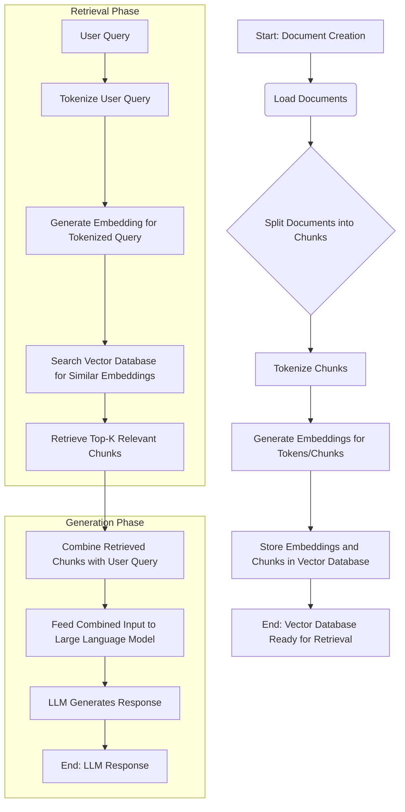

# RAG Flowchart example using Mermaid.js

```mermaid
graph TD
    A[Start: Document Creation] --> B(Load Documents);
    B --> C{Split Documents into Chunks};
    C --> D[Tokenize Chunks]; 
    D --> E[Generate Embeddings for Tokens/Chunks]; 
    E --> F[Store Embeddings and Chunks in Vector Database];
    F --> G[End: Vector Database Ready for Retrieval];

    subgraph Retrieval Phase
        H[User Query] --> I[Tokenize User Query]; 
        I --> J[Generate Embedding for Tokenized Query];
        J --> K[Search Vector Database for Similar Embeddings];
        K --> L[Retrieve Top-K Relevant Chunks];
    end

    subgraph Generation Phase
        L --> M[Combine Retrieved Chunks with User Query];
        M --> N[Feed Combined Input to Large Language Model];
        N --> O[LLM Generates Response];
        O --> P[End: LLM Response];
    end


```
